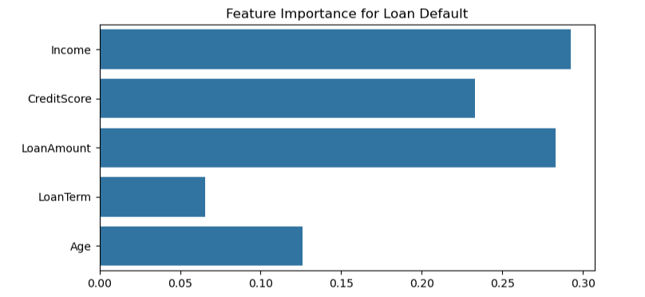
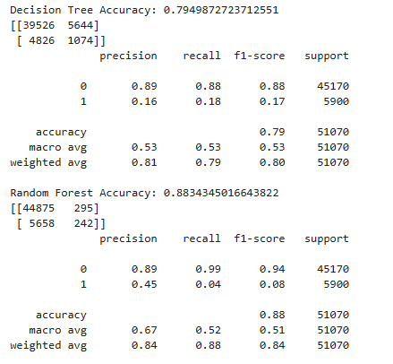
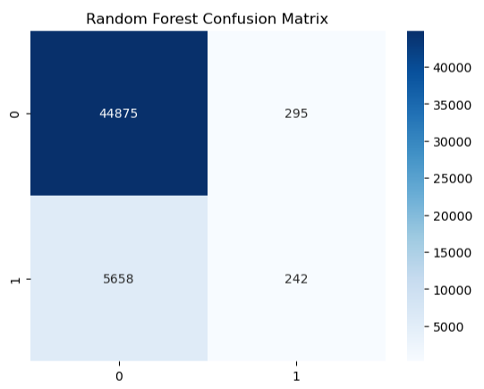

# 💳 Loan Default Prediction using Machine Learning

This project was completed as part of my Machine Learning internship. The objective is to build a predictive model that determines whether a borrower is likely to default on a loan based on financial and personal information.

The project follows a complete machine learning pipeline, including data preprocessing, exploratory data analysis (EDA), feature engineering, model training, and evaluation. It demonstrates how classification algorithms can be used to support risk assessment and assist financial institutions in making informed lending decisions.

## 🚀 Features

* Data cleaning and preprocessing
* Handling missing values
* Exploratory Data Analysis (EDA)
* Feature engineering and selection
* Loan default prediction using machine learning
* Model performance evaluation

## 🛠️ Technologies Used

* Python
* Pandas
* NumPy
* Matplotlib
* Seaborn
* Scikit-learn
* Jupyter Notebook

## 📂 Project Structure

```text
loan-default-prediction/
│
├── data/
├── task6_loan_default_prediction.ipynb
├── README.md
└── requirements.txt
```

## 📊 Workflow

1. Load and explore the loan dataset.
2. Clean and preprocess the data.
3. Handle missing values and encode categorical features.
4. Split the dataset into training and testing sets.
5. Train the machine learning model.
6. Evaluate the model using classification metrics.
7. Predict the likelihood of loan default for new applicants.

## 📊 Output

### Bar Plot



### Decision Tree & Random Forest



### Heatmap



## 📈 Results

The trained model predicts whether a loan applicant is likely to default based on the provided features. This project demonstrates the practical application of machine learning in financial risk analysis and highlights the importance of data preprocessing and feature engineering in building reliable predictive models.

## 🌱 Future Improvements

* Compare the performance of multiple classification algorithms.
* Perform hyperparameter tuning to improve model accuracy.
* Address class imbalance using techniques like SMOTE.
* Deploy the model using Streamlit or Flask for real-time predictions.

---

*This project was completed as part of a Machine Learning internship to strengthen my understanding of data preprocessing, feature engineering, classification models, and predictive analytics using Python and Scikit-learn.*
